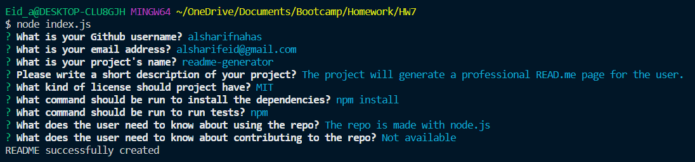
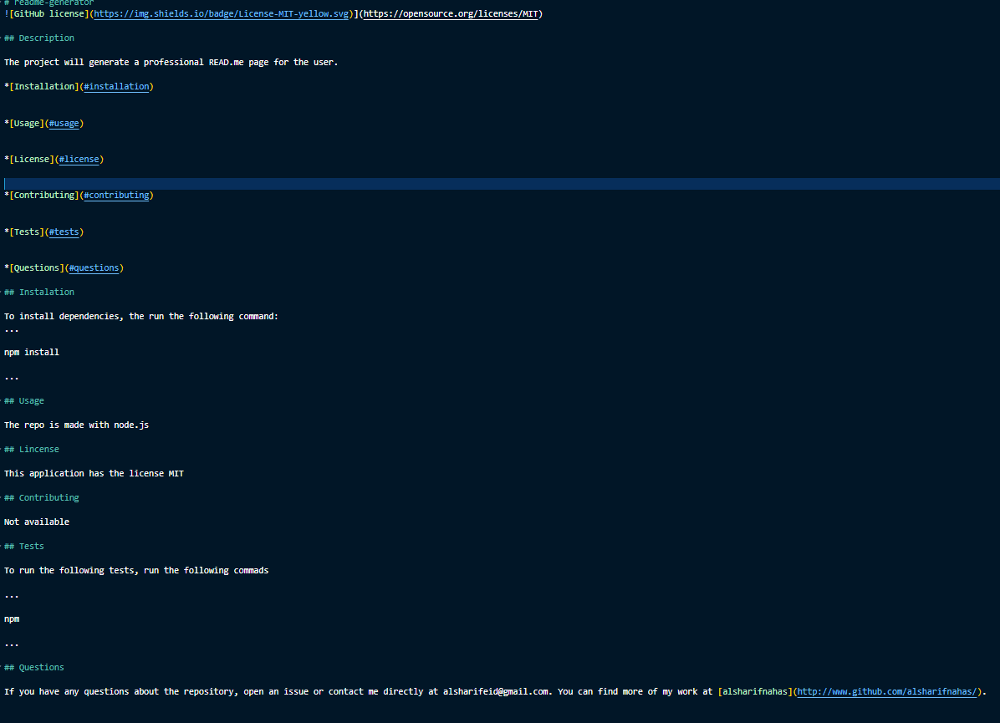

# readme-generator

](https://opensource.org/licenses/MIT)

## Description

This is a command line application that was built using Node.js. The application is meant to help developers with their readme page, so that the readme page will be ready in the sortest amount of time. The developer will be able to customize it more after the page is generated. The application will prompt a series of questions amout the application that will help with building a complete readme. In addtion, the developer will be able to choose the type of license that will be on the page.

\*[Installation](#installation)

\*[Usage](#usage)

\*[License](#license)

\*[Contributing](#contributing)

\*[Questions](#questions)

## Instalation

To install dependencies, the run the following command:
...

npm install

...

## Usage

To use this application, you will have to use the commad "git clone" followed by the url of the repo in order to install it on your local system. This repo includes all of the dependency that is needed to run this application. Inqeuirer package was used in order to finish this project.

**NOTE**: The following images and video are a demo on how the application works.

\*[images]:

\*[video]:

## Lincense

MIT License

Copyright (c) [2021] [Alsharif Nahas]

Permission is hereby granted, free of charge, to any person obtaining a copy
of this software and associated documentation files (the "Software"), to deal
in the Software without restriction, including without limitation the rights
to use, copy, modify, merge, publish, distribute, sublicense, and/or sell
copies of the Software, and to permit persons to whom the Software is
furnished to do so, subject to the following conditions:

The above copyright notice and this permission notice shall be included in all
copies or substantial portions of the Software.

THE SOFTWARE IS PROVIDED "AS IS", WITHOUT WARRANTY OF ANY KIND, EXPRESS OR
IMPLIED, INCLUDING BUT NOT LIMITED TO THE WARRANTIES OF MERCHANTABILITY,
FITNESS FOR A PARTICULAR PURPOSE AND NONINFRINGEMENT. IN NO EVENT SHALL THE
AUTHORS OR COPYRIGHT HOLDERS BE LIABLE FOR ANY CLAIM, DAMAGES OR OTHER
LIABILITY, WHETHER IN AN ACTION OF CONTRACT, TORT OR OTHERWISE, ARISING FROM,
OUT OF OR IN CONNECTION WITH THE SOFTWARE OR THE USE OR OTHER DEALINGS IN THE
SOFTWARE.

## Contributing

Please open a new issue first, fork the repo, then create a pull request in order for me to look at the changes that you've made

## Questions

If you have any questions about the repository, open an issue or contact me directly at alsharifeid@gmail.com. You can find more of my work at [alsharifnahas](http://www.github.com/alsharifnahas/).

© 2020 Alsharif Nahas. Confidential and Proprietary. All Rights Reserved.
